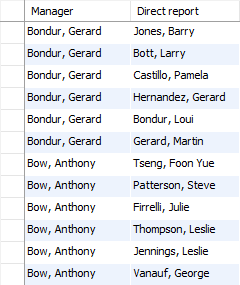
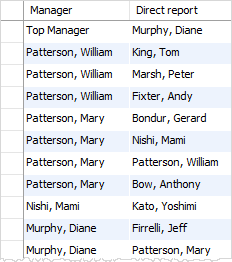

# MySQL

[Getting Started with MySQL Quickly](https://www.mysqltutorial.org/getting-started-with-mysql/)

## install on mac

https://flaviocopes.com/mysql-how-to-install/

```sh
# install, start and secure
$ brew install mysql
$ brew services start mysql
$ mysql_secure_installation
...
$ brew services stop mysql

# start NOT in daemon mode (auto re-start it at reboo)
mysql.server start
mysql server stop
```


## Connect to server

```sh
$ mysql -u root -p
```

`-u root` means that you connect to the MySQL Server using the user account `root`.

`-p` instructs mysql to prompt for a password.


## Load a database

```
mysql> source c:\temp\mysqlsampledatabase.sql
```


## Basics

### SELECT...FROM

```mysql
SELECT 
    lastName, 
    firstName, 
    jobTitle
FROM
    employees;
```

```
+-----------+-----------+----------------------+
| lastname  | firstname | jobtitle             |
+-----------+-----------+----------------------+
| Murphy    | Diane     | President            |
| Patterson | Mary      | VP Sales             |
| Firrelli  | Jeff      | VP Marketing         |
| Patterson | William   | Sales Manager (APAC) |
| Bondur    | Gerard    | Sale Manager (EMEA)  |
```


select all columns

```
SELECT * 
FROM employees;
```


### ORDER BY

```mysql
SELECT 
   select_list
FROM 
   table_name
ORDER BY 
   column1 [ASC|DESC], 
   column2 [ASC|DESC],
   ...;
```

- First, sort the result set by the values in the `column1` in ascending order.
- Then, sort the sorted result set by the values in the `column2` in descending order. Note that **the order of values in the `column1` will not change in this step, only the order of values in the `column2` changes.**
- `ASC` is **default**

e.g.

```mysql
SELECT
	contactLastname,
	contactFirstname
FROM
	customers
ORDER BY
	contactLastname;
```

```
+-----------------+------------------+
| contactLastname | contactFirstname |
+-----------------+------------------+
| Accorti         | Paolo            |
| Altagar,G M     | Raanan           |
| Andersen        | Mel              |
| Anton           | Carmen           |
| Ashworth        | Rachel           |
| Barajas         | Miguel           |
| Benitez         | Violeta          |
| Bennett         | Helen            |
| Berglund        | Christina        |
| Bergulfsen      | Jonas            |
| Bertrand        | Marie            |
| Brown           | Julie            |
| Brown           | Ann              |
| Brown           | William          |
| Calaghan        | Ben              |
| Camino          | Alejandra        |
```


### sort data using FIELD()

The `FIELD()` function has the following syntax:

```sql
FIELD(str, str1, str2, ...);
```

The `FIELD()` function returns the position of the str in the str1, str2, … list. If the str is not in the list, the `FIELD()` function returns 0. For example, the following query returns 1 because the position of the string ‘A’ is the first position on the list `'A'`, `'B'`, and `'C'`:

```mysql
SELECT FIELD('A', 'A', 'B','C');
```

Output:

```
+--------------------------+
| FIELD('A', 'A', 'B','C') |
+--------------------------+
|                        1 |
+--------------------------+
1 row in set (0.00 sec)
```

e.g.

```sql
SELECT 
    orderNumber, status
FROM
    orders
ORDER BY FIELD(status,
        'In Process',
        'On Hold',
        'Cancelled',
        'Resolved',
        'Disputed',
        'Shipped');
```

Output:

```
+-------------+------------+
| orderNumber | status     |
+-------------+------------+
|       10425 | In Process |
|       10421 | In Process |
|       10422 | In Process |
|       10420 | In Process |
|       10424 | In Process |
|       10423 | In Process |
|       10414 | On Hold    |
|       10401 | On Hold    |
|       10334 | On Hold    |
|       10407 | On Hold    |
...
```


### WHERE

```sql
SELECT 
    lastname, 
    firstname, 
    jobtitle
FROM
    employees
WHERE
    jobtitle = 'Sales Rep'; # search condition
```
### DISTINCT 去重

When executing the `SELECT` statement with the `DISTINCT` clause, MySQL evaluates the `DISTINCT` clause after the `FROM`, `WHERE`, and `SELECT` clause and before the `ORDER BY` clause:


```sql
SELECT 
    DISTINCT lastname
FROM
    employees
ORDER BY 
    lastname;
```

#### MySQL DISTINCT with multiple columns

When you specify multiple columns in the `DISTINCT` clause, the `DISTINCT` clause will use the **combination** of values in these columns to determine the uniqueness of the row in the result set.

```sql
SELECT DISTINCT
    state, city
FROM
    customers
WHERE
    state IS NOT NULL
ORDER BY 
    state, 
    city;
```

```
+---------------+----------------+
| state         | city           |
+---------------+----------------+
| BC            | Tsawassen      |
| BC            | Vancouver      |
| CA            | Brisbane       |
| CA            | Burbank        |
| CA            | Burlingame     |
| CA            | Glendale       |
| CA            | Los Angeles    |
| CA            | Pasadena       |
| CA            | San Diego      |
...
```

### operators

**AND, OR, IN, NOT IN, BETWEEN, LIKE (% _ \ESCAPE)** 

**LIMIT**

or `LIMIT row_count OFFSET offset`

```sql
SELECT 
    select_list
FROM 
    table_name
ORDER BY 
    sort_expression
LIMIT offset, row_count;
```

1) get the highest or lowest rows
2) Pagination
3) get the nth highest or lowest value

**IS NULL, IS NOT NULL**
**AS** alias

```sql
# column alias
SELECT 
   [column_1 | expression] AS `descriptive name`
FROM 
   table_name;
# table alias
SELECT 
    e.firstName, 
    e.lastName
FROM
    employees e
ORDER BY e.firstName;
```

## JOIN

A relational database consists of multiple related tables linking together using common columns, which are known as [**foreign key**](https://www.mysqltutorial.org/www.mysqltutorial.org/mysql-foreign-key/) columns.

### INNER JOIN


```sql
SELECT 
    productCode, 
    productName, 
    textDescription
FROM
    products t1
INNER JOIN productlines t2 
    ON t1.productline = t2.productline;
```
Or `USING`
```sql
SELECT 
    productCode, 
    productName, 
    textDescription
FROM
    products
INNER JOIN productlines USING (productline);
```

### LEFT JOIN


WHERE 和 ON 的区别 
https://www.mysqltutorial.org/mysql-basics/mysql-left-join/：Condition in WHERE clause vs. ON clause

### RIGHT JOIN

 `RIGHT JOIN` and `LEFT JOIN` clauses are functionally equivalent, and they can replace each other as long as the table order is reversed.

### SELF JOIN

### with inner join

Display employees and their manager

```sql
SELECT 
    CONCAT(m.lastName, ', ', m.firstName) AS Manager,
    CONCAT(e.lastName, ', ', e.firstName) AS 'Direct report'
FROM
    employees e
INNER JOIN employees m ON 
    m.employeeNumber = e.reportsTo
ORDER BY 
    Manager;
```



### with left join

Display the president (who has no manager)
```sql
SELECT 
    IFNULL(CONCAT(m.lastname, ', ', m.firstname),
            'Top Manager') AS 'Manager',
    CONCAT(e.lastname, ', ', e.firstname) AS 'Direct report'
FROM
    employees e
LEFT JOIN employees m ON 
    m.employeeNumber = e.reportsto
ORDER BY 
    manager DESC;
```


